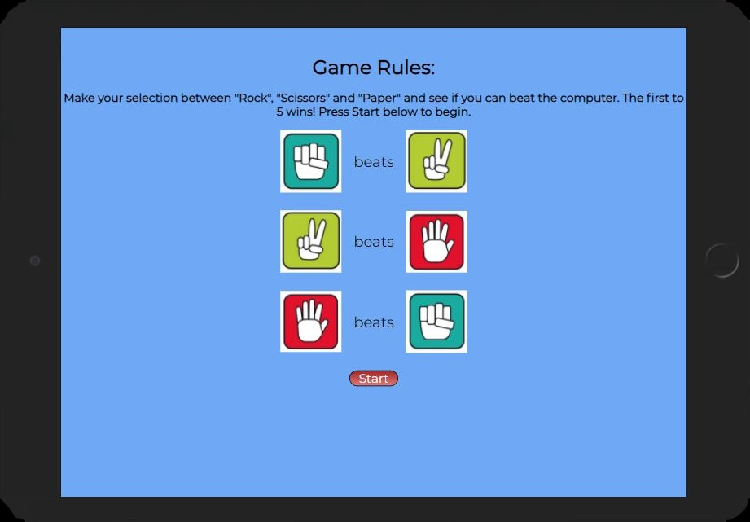

.

# Welcome to Rock / Scissors / Paper Game

This project was developed to satisfy the second Milestone Project requirements for the Full Stack Software Developement program at the [Code Institute](https://www.codeinstitute.net). As a second project, this site is created using HTML5, CSS3 and JavaScript languages.

The purpose of this project is to demonstrate an understanding of how JavaScript is implemented and interpreted by the browser. In this example I have chosen to create a simple game of Rock / Scissors / Paper to demonstrate this understanding.

## Table of Contents
* [Instructions](Instructions)
* [User Stories](User-Stories)
* [Features](Features)
* [Future Features](Future-Features)
* [Wireframes](Wireframes)
* [Typography and Color schemes](Typography-and-Color-schemes)
* [Testing](Testing)
* [Unfixed Bugs](Unfixed-Bugs)
* [Deployment](Deployment)
* [Credits](Credits)

# Instructions

The purpose of the Rock Paper Scissors game is to create a scene where the participants throw a series of moves in order to crush each other. The participants are usually two, and hand gestures represent their moves. The Rock Paper Scissors game has three moves represented by the “Rock,” the “Paper,” and the “Scissors.” The Rock is the move thrown by clenching the fist. The Paper is the move thrown by outstretching your hand. The Scissors is exhibited by using the thumb to hold down the ring finger and pinky while allowing space between the index and middle fingers as they point toward the opponent.

You will see from the image at the top that the Rock beats Scissors. The Scissors beats Paper and the Paper beats Rock. [WRPS Association](https://wrpsa.com) 

# User Stories
## Prospective User

# Features

# Wireframes

# Typography and Color schemes

# Testing

### _**Validator Testing**_

#### _**HTML - W3C Test**_

# Unfixed Bugs

# Deployment

# Credits

### _**Content**_

### _**Media**_