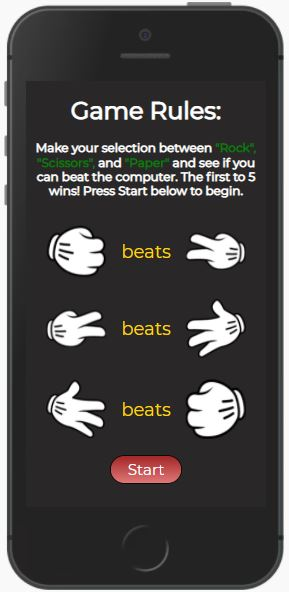

# Welcome to Rock / Paper / Scissors

This project was developed to satisfy the second Milestone Project requirements for the Full Stack Software Developement program at the [Code Institute](https://www.codeinstitute.net). As a second project, this site is created using HTML5, CSS3 and JavaScript languages. This is a fully responsive website however the design is focussed more for playing on mobile phones and tablets for better UX.

The purpose of this project is to demonstrate an understanding of how JavaScript is implemented and interpreted by the browser. In this example I have chosen to create a simple game of Rock / Scissors / Paper to demonstrate this understanding.

## Table of Contents
* [Instructions](Instructions)
* [User Stories](User-Stories)
* [Features](Features)
* [Future Features](Future-Features)
* [Wireframes](Wireframes)
* [Typography and Color schemes](Typography-and-Color-schemes)
* [Testing](Testing)
* [Unfixed Bugs](Unfixed-Bugs)
* [Deployment](Deployment)
* [Credits](Credits)

# Instructions

The purpose of the Rock Paper Scissors game is to create a scene where the participants throw a series of moves in order to crush each other. The participants are usually two, and hand gestures represent their moves. The Rock Paper Scissors game has three moves represented by the “Rock,” the “Paper,” and the “Scissors.” The Rock is the move thrown by clenching the fist. The Paper is the move thrown by outstretching your hand. The Scissors is exhibited by using the thumb to hold down the ring finger and pinky while allowing space between the index and middle fingers as they point toward the opponent.

The basic rules are as follows: "Rock" beats "Scissors". "Scissors" beats "Paper" and "Paper" beats "Rock".

For a full version of the rules please visit the "World Rock Paper Scissors Association webite; [WRPS Association](https://wrpsa.com) 

# User Stories
## Prospective User

I am a prospective Rock Scisorrs Paper fan and want to be able to:

* Immediately view the home page and identify the basic rules of playing the game.
* I am a keen gamer and will want to know in more detail about the rules of the game and how I can become an association member.
* I will want to easily see the start game button to begin a new game which will direct me to the game page.
* On the game page I will identify the selections available to me via an image representation of "Rock", "Scissors" and "Paper".
* At the top of the page I will see the selection results made my myself and my competitor and the result of "Win", "Loose", or "Draw" displayed.
* Below this view section, I will see a scoreboard tallying up the scores from both players and for draws.
* First of the 3 'options' to arrive at 5 points will determine the result of the game.
* Once 5 points is reached I will see a modal popup which will prevent me from carrying on with the selections and the game will stop.
* The modal popup will provide me with a choice of either starting a new game or returning to the home page.

# Features

### _**The Home Page**_

The first version of this game, the User will immediatley be presented with the game rules on the home page, explaining the User the selections available and how to win points. 

The home page will also contain a "start" button which will direct the User to the "Game Page". 

Scrolling down on the home page the User will find a link which will direct the User to the website for the World Rock Paper Scissors Association [WRPS Association](https://wrpsa.com), which will open up on a new page. Here the User will find a complete set of rules and how to become a professional player.

### _**The Game Page**_

For this first release, the User will identify the player selections and results at the top of the game page.

Below this section the User will identify three optional buttons to choose from, each button representing the choices available - "Rock", "Paper" and "Scissors".

Whatever selection is made by the User, the Computer will generate a random selection. If the User wins, this will be displayed on the reult line and 1 point will be added to the Player Score, illustrated on the scoreboard, which is placed below the selection images. If the User selection is the same as the Computer selection, this will result in a Draw and the 1 point will be added to the Draw scoreboard. Similarly, should the Computer win, 1 point will be added to the Computer scoredboard.

The first player to reach 5 points will win the game.

The game buttons will always remain visible and active in case the User wishes to interrupt the game before reaching the five point objective.

Once the five points are reached, the User will see a modal pop-up appear which will prevent the User from making further selections of "Rock", "Paper", "Scissors" and the User will be prompted with a message and asked if they would like to return to the home page or continue playing.

# Wireframes

### _**Home Page**_

### _**Game Page**_

### _**Game Page with Modal Pop-up**_

# Typography and Color schemes

The font used throughout this site is Montserrat. Open-sans is used as the fallback font.

The color schemes are chosen to enhance player selection buttons with a background in dark grey to avoid any distractions from the rules text and player and computer selection results.

The modal Pop-up is of a light color which will cover the player selection buttons with the aim on focussing the player to the modal pop-up. The modal pop-up contains two buttons of diffrerent color, red styling to return to home page and green color to continue playing more games.

# Testing

I tested this site on both IE and Google Chrome browsres and can confirm that it works on both browsers.

I can confirm that this project is responsive, it looks good on the screens provided by the devtools.

I can confirm the the site link works well and that the text is legiable in all settings.

### _**Validator Testing**_

#### _**HTML - W3C Test**_

Home Page - Clean of Errors

Game Page - Two Errors found

Game Page - Two Errors fixed

#### _**CCS Test**_

#### _**JShint Test**_

JavaScript code checked with no errors identified

# Unfixed Bugs

There are no bugs identified on this version.

# Deployment

# Credits

### _**Content**_

### _**Media**_